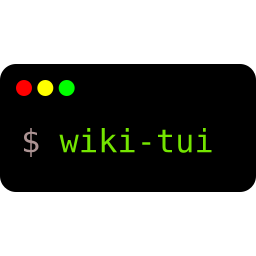

[](https://github.com/Builditluc/wiki-tui/graphs/contributors)
<!-- ALL-CONTRIBUTORS-BADGE:START - Do not remove or modify this section -->
[](#contributors-)
<!-- ALL-CONTRIBUTORS-BADGE:END -->
[](https://github.com/Builditluc/wiki-tui/stargazers)
[](https://github.com/Builditluc/wiki-tui/issues)
[](https://github.com/Builditluc/wiki-tui/blob/stable/LICENSE.txt)


<br />
<p align="center">
  <a href="https://github.com/Builditluc/wiki-tui">
    
  </a>

  <h3 align="center">WIKI-TUI</h3>

  <p align="center">
    A simple and easy to use Wikipedia Text User Interface
  </p>
</p>

## Preview
### How it looks


 <br>
Note: These Screenshots were taken on [iTerm2](https://iterm2.com) (MacOS) with the [Fira Code](https://github.com/tonsky/FiraCode) font

### Usage

If you want to search for an article quickly, you can pass the search term as an argument.
```
wiki-tui <ARTICLE>
```
wiki-tui then searches for this article automatically. 

#### Controls
<table>
  <tr><th>Key</th><th>Function</th></tr>
  <tr><td>q</td><td>Quit the program (except when inside the search bar)</td></tr>
  <tr><td>Up and Down</td><td>Scrolling</td></tr>
  <tr><td>Left and Right</td><td>Select the next link (only in the article view)</td></tr>
</table>

## Installation
The binary executable is `wiki-tui`

### Cargo
```
cargo install wiki-tui
```
### NetBSD
Using the package manager
```
pkgin install wiki-tui
```
Building from source
```
cd /usr/pkgsrc/www/wiki-tui
make install
```

### Nix
The wiki-tui package is in the [nixpkgs](https://search.nixos.org/packages?channel=unstable&show=wiki-tui&from=0&size=50&sort=relevance&type=packages&query=wiki-tui) package repository.

Either install it with `nix-env -iA wiki-tui`, get it temporarily with `nix-shell -p wiki-tui` or add it to your configuration.

## Configuration

### Location of the config file
#### MacOS, Linux and NetBSD
```
$HOME/.config/wiki-tui/config.toml
```
#### Windows
```
C:\Users\{USERNAME}\wiki-tui\config.toml
```

### Settings
Default configuration
```toml
[api]
base_url = "https://en.wikipedia.org/"  # this is the url of wikipedia, it can be changed to change the language of wikipedia 

# The settings here are all colors and can be set by either the name of the color or a hex string (valid formats are: #ffffff, #fff)
# The actual colors displayed in your terminal can change depending on your terminal settings

[theme]
background = "white"                    # color used for View backgrounds
title = "red"                           # color used for the title text
highlight = "red"                       # color used for highlighting text
highlight_inactive = "blue"             # color used for highlighting inactive text
highlight_text = "white"                # color used for highlighted text
text = "black"                          # color used for the text
search_match = "red"                    # color used for a search match in the results view

# You can also change the theme of specific views
# These settings are the same for every supported view
[theme.search_bar]
background = "white"
title = "red"
highlight = "red"
highlight_inactive = "blue"
highlight_text = "white"
text = "black"

# Currently, these views are supported:
# - search_bar
# - search_results
# - search_preview
# - article_view
# - toc_view

[logging]
enabled = true                          # can be either true or false. enables/disables logging
log_dir = "wiki_tui.log"                # location of the file where the log will be written to
log_level = "Info"                      # log level to be used, can be Debug, Info, Warn, Error
```

## Contributing
See [contributing guidelines](/CONTRIBUTING.md) for contributing conventions.
Make sure to change the branch to `experimental` before making any changes to the code.

## Similar Projects

* [hexrcs/wiki-cli](https://github.com/hexrcs/wiki-cli)

## Acknowledgements

* [cursive](https://github.com/gyscos/cursive)
* Some parts of [Best-README-Template](https://github.com/0fakhri/Best-README-Template)

## Contributors ✨

Thanks goes to these wonderful people ([emoji key](https://allcontributors.org/docs/en/emoji-key)):

<!-- ALL-CONTRIBUTORS-LIST:START - Do not remove or modify this section -->
<!-- prettier-ignore-start -->
<!-- markdownlint-disable -->
<table>
  <tr>
    <td align="center"><a href="https://github.com/Builditluc"><br /><sub><b>Builditluc</b></sub></a><br /><a href="#ideas-Builditluc" title="Ideas, Planning, & Feedback">🤔</a> <a href="https://github.com/Builditluc/wiki-tui/commits?author=Builditluc" title="Code">💻</a> <a href="https://github.com/Builditluc/wiki-tui/commits?author=Builditluc" title="Documentation">📖</a></td>
  </tr>
</table>

<!-- markdownlint-restore -->
<!-- prettier-ignore-end -->

<!-- ALL-CONTRIBUTORS-LIST:END -->

This project follows the [all-contributors](https://github.com/all-contributors/all-contributors) specification. Contributions of any kind welcome!