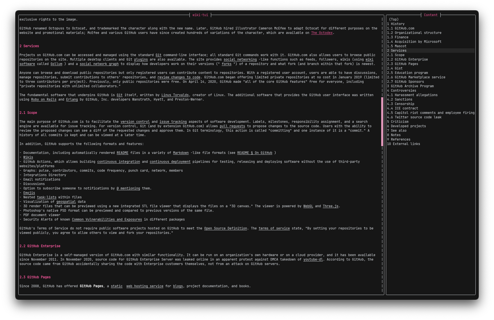

<!-- ALL-CONTRIBUTORS-BADGE:START - Do not remove or modify this section -->

<!-- ALL-CONTRIBUTORS-BADGE:END -->

 

  

  <h3 align="center">WIKI-TUI</h3>

  

    A simple and easy to use Wikipedia Text User Interface
  

> Note: wiki-tui is still under active development and breaking changes can occur. Please always check the release notes before upgrading

## Preview
### How it looks

> Note: These Screenshots were taken on [iTerm2](https://iterm2.com) (MacOS) with the [Fira Code](https://github.com/tonsky/FiraCode) font

For more information, please visit the [website](https://builditluc.github.io/wiki-tui/)

## Similar Projects

* [hexrcs/wiki-cli](https://github.com/hexrcs/wiki-cli)
* [yashinghcodes/wik](https://github.com/yashsinghcodes/wik)

## Acknowledgements

* [cursive](https://github.com/gyscos/cursive)
* [Best-README-Template](https://github.com/0fakhri/Best-README-Template)

## Contributors ✨

Thanks goes to these wonderful people ([emoji key](https://allcontributors.org/docs/en/emoji-key)):

<!-- ALL-CONTRIBUTORS-LIST:START - Do not remove or modify this section -->
<!-- prettier-ignore-start -->
<!-- markdownlint-disable -->
<table>
  <tbody>
    <tr>
      <td align="center"><a href="https://github.com/Builditluc"> <b>Builditluc</b></a> <a href="#ideas-Builditluc" title="Ideas, Planning, & Feedback">🤔</a> <a href="https://github.com/Builditluc/wiki-tui/commits?author=Builditluc" title="Code">💻</a> <a href="https://github.com/Builditluc/wiki-tui/commits?author=Builditluc" title="Documentation">📖</a> <a href="https://github.com/Builditluc/wiki-tui/issues?q=author%3ABuilditluc" title="Bug reports">🐛</a></td>
      <td align="center"><a href="https://github.com/0323pin"> <b>0323pin</b></a> <a href="https://github.com/Builditluc/wiki-tui/issues?q=author%3A0323pin" title="Bug reports">🐛</a> <a href="#platform-0323pin" title="Packaging/porting to new platform">📦</a></td>
      <td align="center"><a href="https://github.com/legendofmiracles"> <b>legendofmiracles</b></a> <a href="#platform-legendofmiracles" title="Packaging/porting to new platform">📦</a></td>
      <td align="center"><a href="https://github.com/ThomasFrans"> <b>Thomas</b></a> <a href="#platform-ThomasFrans" title="Packaging/porting to new platform">📦</a> <a href="https://github.com/Builditluc/wiki-tui/issues?q=author%3AThomasFrans" title="Bug reports">🐛</a></td>
      <td align="center"><a href="https://github.com/nunotexbsd"> <b>Nuno Teixeira</b></a> <a href="#platform-nunotexbsd" title="Packaging/porting to new platform">📦</a></td>
    </tr>
  </tbody>
</table>

<!-- markdownlint-restore -->
<!-- prettier-ignore-end -->

<!-- ALL-CONTRIBUTORS-LIST:END -->

This project follows the [all-contributors](https://github.com/all-contributors/all-contributors) specification. Contributions of any kind welcome!
