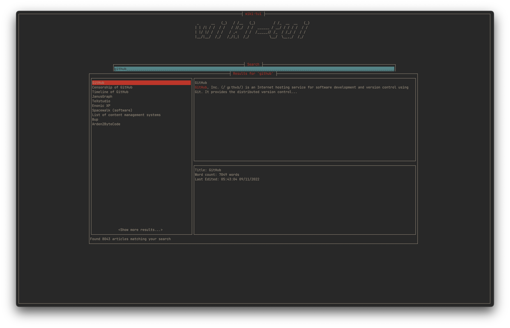
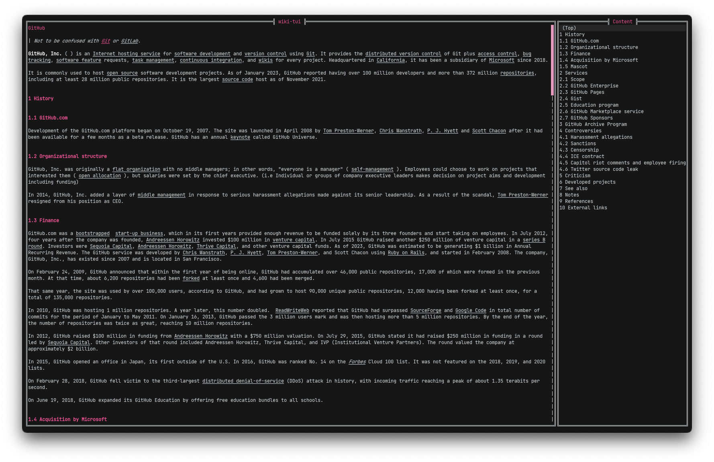
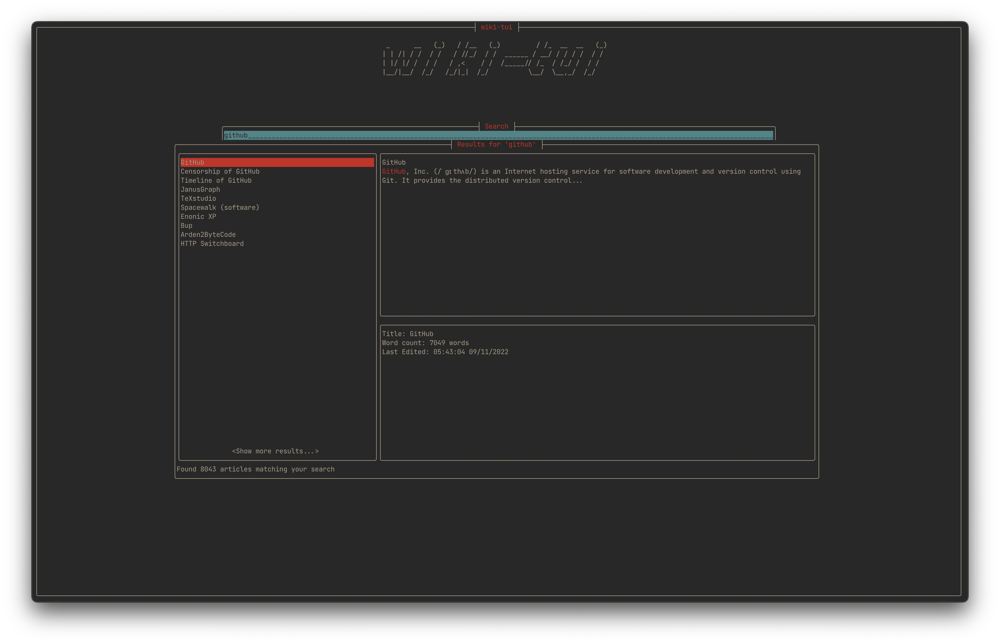
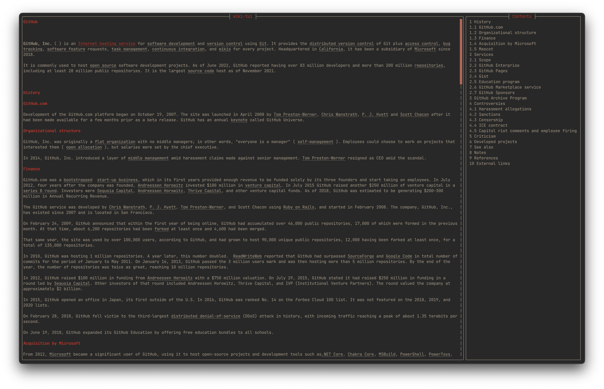

# Theme Settings

!!! warning
    The actual colors displayed in your terminal can change depending on your terminal settings

## About Colors

All color settings can be the actual color written out as a word, available values are:

* `black`
* `red`
* `green`
* `yellow`
* `blue`
* `magenta`
* `cyan`
* `white`

And their `light` variants (`light red`, `light white`, ...). Also if you want to use the terminal default, you can set the color to `default`

Hex values are also supported.

## Global palette

[:octicons-tag-24: 0.3.0][release-0.3.0]

wiki-tui supports changing the color palette. If you change them globally, every interface of wiki-tui will change.

#### Background

[:octicons-tag-24: 0.3.0][release-0.3.0] ·
:octicons-milestone-16: Default: `white`

This color is used for the view backgrounds

```toml
theme.background = "white"
```

#### Title

[:octicons-tag-24: 0.3.0][release-0.3.0] ·
:octicons-milestone-16: Default: `red`

This color is used for the title

```toml
theme.title = "red"
```

#### Highlight

[:octicons-tag-24: 0.3.0][release-0.3.0] ·
:octicons-milestone-16: Default: `red`

This color is used for the highlighted text background

```toml
theme.highlight = "red"
```

#### Highlight Inactive

[:octicons-tag-24: 0.3.0][release-0.3.0] ·
:octicons-milestone-16: Default: `blue`

This color is used for the inactive text that is highlighted

```toml
theme.highlight_inactive = "blue"
```

#### Highlight Text

[:octicons-tag-24: 0.3.0][release-0.3.0] ·
:octicons-milestone-16: Default: `white`

This color is used for the highlighted text

```toml
theme.highlight_text = "white"
```

#### Text

[:octicons-tag-24: 0.3.0][release-0.3.0] ·
:octicons-milestone-16: Default: `black`

This color is used for the text color

```toml
theme.text = "black"
```

#### Search Match 

[:octicons-tag-24: 0.3.0][release-0.3.0] ·
:octicons-milestone-16: Default: `red`

This color is used for a search match

```toml
theme.search_match = "red"
```

## Customize single views

[:octicons-tag-24: 0.4.0][release-0.4.0]

You can also only change colors for a single view (for example the search bar). Every supported view has the same settings as the global theme settings. Supported Views are:

* `search_bar`
* `search_results`
* `search_preview`
* `article_view`
* `toc_view`

Here is a sample config for changing the colors of the search bar:

```toml
[theme.search_bar]
background = "white"
title = "red"
highlight = "red"
highlight_inactive = "blue"
highlight_text = "white"
text = "black"
```

## Configure the borders

:fontawesome-solid-microchip: pre-release
:octicons-milestone-16: Default: `default` | `thin`

!!! warning
    Depending on your font, some border styles may differ from the examples below

You can change the look of the borders in wiki-tui. Available styles are:

* `thin` | `default`
* `heavy`
* `round`

> The excat unicode characters used for the borders can be found in the following file: `src/ui/panel.rs`

??? example "Thin / Default"
    ```toml
    theme.border = "default"
    ```
    or
    ```toml
    theme.border = "thin"
    ```

    
    

??? example "Heavy"
    ```toml
    theme.border = "heavy"
    ```

    
    

??? example "Round"
    ```toml
    theme.border = "round"
    ```

    
    

[release-0.3.0]: https://github.com/Builditluc/wiki-tui/releases/tag/v0.3
[release-0.4.0]: https://github.com/Builditluc/wiki-tui/releases/tag/v0.4
