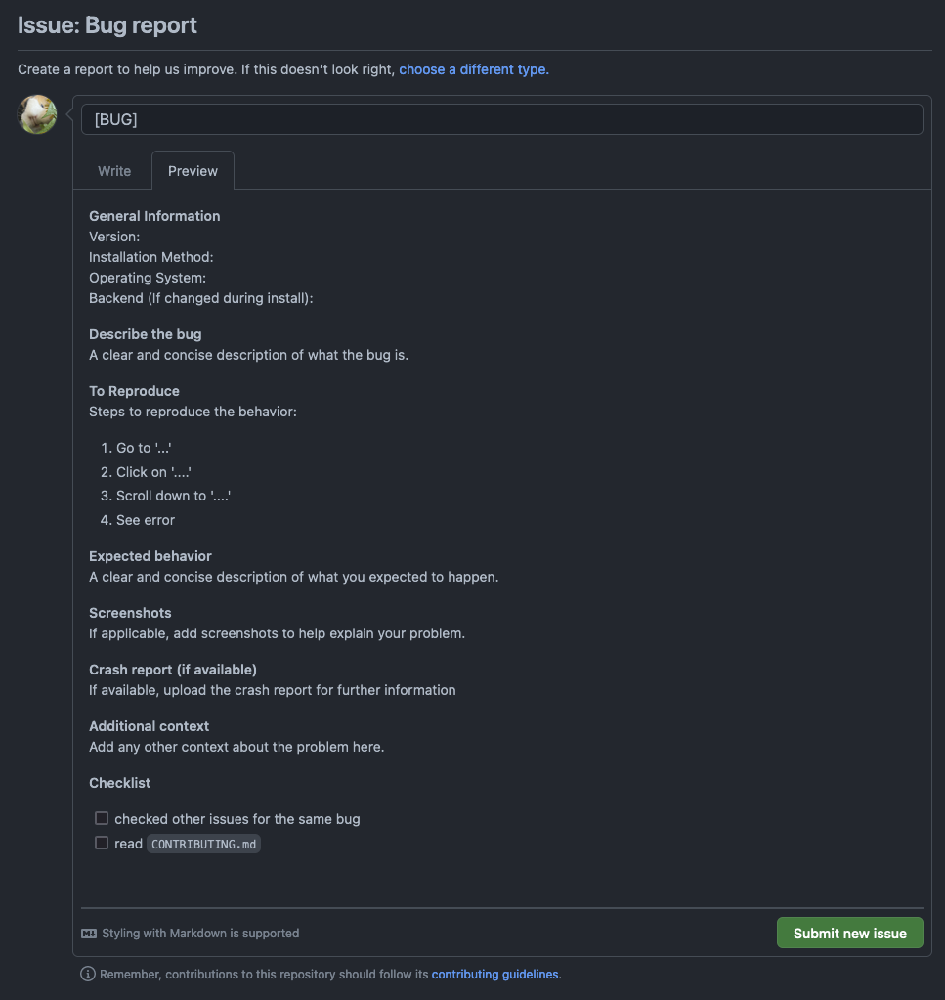

If you are here, that means you've found a bug and want to report it. Great! Why great? Because if you report the bug we can fix it.

!!! info
    Before filing a bug report, please check if there were any previous bug reports describing the same thing. If you want, you can then leave a comment there like "Same issue here" or give the issue a :thumbsup:

## Create the issue

When creating a new issue, please choose the `Bug report` template and fill it in. It should now look something like this




## Fill it out!

Your next step is to fill in all of the necessary information. Below is everything you need to fill out explained.

### General Information

#### `Version`

This is the version of `wiki-tui` you are currently using. If you don't know which version you have, you can check it by running the following command

```
wiki-tui --version
```

#### `Installation Method`

This is the method you've used to [install](../getting-started/intallation.md) wiki-tui.

#### `Operating System`

Should be pretty self-explanatory. If you're using Linux, please write down the distro name.

#### `Backend`

The cargo installation method enables you to [choose a different backend](../getting-started/installation.md#cargo) during the installation phase. If you've changed it please write down the name of the backend, if not or if you are using another installation method you can just leave it empty or write `default`

### Describe the bug

Here you can write down a clear and concise description of what the bug is. This can range from a simple, "wiki-tui crashes when I try to search" to a more detailed description. Size doesn't matter here as long as we can understand what the bug is

### To Reproduce

Please detail here what you have done to encounter the bug. This is the most important part because if we can't reproduce the bug, we cannot fix it. It can either be a numbered list or a big blob of text. It doesn't matter as long as we know what to do to reproduce the bug

### Expected behavior

If the bug is relatively simple like a crash you can just write down "doesn't crash" but if its a bit more complicated, please write here what you have expected to happen

### Screenshots

A picture says more than a thousand words! If you feel like a picture would further help explain you problem, you can upload them here

### Crash report (if available)

When a crash occurs, a crash report is generated and placed in your current working directory. Please upload this report if you have one because it gives us even more information on what the program was trying to do when it crashed.

### Additional context

If you have any more information you would like to give us and it doesn't fit in any of the described fields, you can put it here

### Checklist

Here you can check the things you have already done


## Submit and wait

When you've filled out the template. You can proudly click on that green `Submit new issue` button.

<center>
<b>
:partying_face: You did it! Thank you very much! :partying_face:
</b>
</center>

You have completed your part and now we'll do ours! Please stick around to answer any further questions we might have. We'll keep you updated on the progress of the fix and may ask you to test the patch on your local machine.
