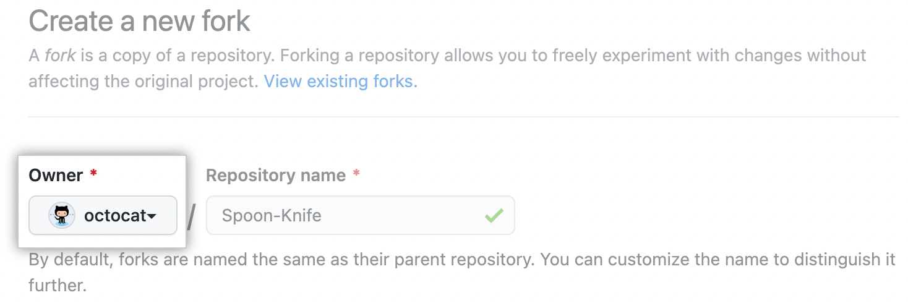
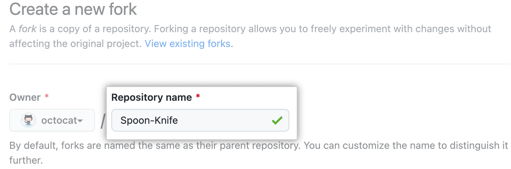
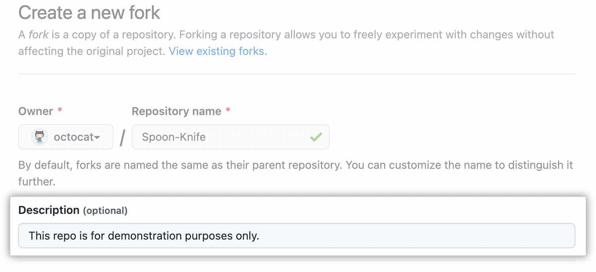
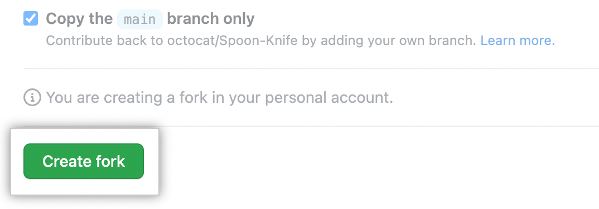

<center>
<b>
You want to develop a new feature or fix a bug, great!
</b>
</center>

## Prerequisites

Before the actual development can start, please check that you have the following things installed:

??? tip "If you are using nix..."
    ..., you can use the `shell.nix` file. This will install all dependencies (except the code editor, ofc) for you!

* The programming language [Rust](https://www.rust-lang.org/tools/install)
* A functioning version of git
* Some code editor
* If you want to [change the backend](../getting-started/installation.md), please make sure to check if you need extra dependencies

And that's it!

## Fork and clone the Repo

First, you have to fork the wiki-tui repository. 

??? info "From the [GitHub Documentation](https://docs.github.com/en/get-started/quickstart/fork-a-repo#forking-a-repository):"
    > Images are taken from the Documentation and the numbers will be different for wiki-tui

    1. On GitHub.com, navigate to the [Builditluc/wiki-tui](https://github.com/Builditluc/wiki-tui) repository.
    2. In the top-right corner of the page, click **Fork**.
      
    3. Select an owner for the forked repository.
      
    4. By default, forks are named the same as their parent repositories. You can change the name of the fork to distinguish it further.
      
    5. Optionally, add a description of your fork.
      
    6. Choose whether to copy only the default branch or all branches to the new fork. By default, only the default branch is copied.
      
    7. Click **Create fork**.
      

Then you have to clone your fork to your machine.

??? info "From the [GitHub Documentation](https://docs.github.com/en/get-started/quickstart/fork-a-repo#cloning-your-forked-repository):"
    > Images are taken from the Documentation and may differ for wiki-tui
    
    1. On GitHub.com, navigate to **your fork** of the wiki-tui repository.
    2. Above the list of files, click :octicons-download-24: **Code**.
      
    3. Copy the URL for the repository.
      
    4. Open Terminal
    5. Change the current working directory to the location where you want the cloned directory.
    6. Type `git clone, and then paste the URL you copied earlier. It will look like this, with your GitHub username instead of `YOUR-USERNAME`:
      ```
      $ git clone https://github.com/YOUR-USERNAME/wiki-tui
      ```
    7. Press **Enter**. Your local clone will be created.
      ```
      $ git clone https://github.com/YOUR-USERNAME/wiki-tui
      > Cloning into `wiki-tui`...
      > remote: Counting objects: 10, done.
      > remote: Compressing objects: 100% (8/8), done.
      > remote: Total 10 (delta 1), reused 10 (delta 1)
      > Unpacking objects: 100% (10/10), done.
      ```

## Create a branch

Now that you've forked and cloned the repository you can create a branch for your feature or bug fix. You can create a branch like this:

=== "Feature"

    ```
    $ git checkout -b add-feature
    ```

    You can also use `add-{FEATURE-NAME}` for the branch name or something entirely different. It's up to you but it would be nice if the branch has a descriptive name of what it changes

=== "Bug Fix"

    ```
    $ git checkout -b fix-bug
    ```

    You can also use `fix-{BUG-NAME}` for the branch name or something entirely different. It's up to you but it would be nice if the branch has a descriptive name of what it changes

<center>
Now you are ready to make your changes!
</center>

## Before you make a commit

### Pre-Commit Checks

Before making a commit, please do the following things:

* check compilation with `cargo build`
* format your code with `cargo fmt`
* Clippy check your code with `cargo clippy` and fix any warnings

Every commit should only contain relatively independent change (that is, multiple types of modifications are not allowed to be submitted in one commit)

### Commit Message Format 

The Commit Message needs to follow this simple format:

```
<type>: <subject>
```

The message should not be longer than 50 characters

This allows the commit message to be easier to read on GitHub as well as in various git tools.

The `type` field mainly explains the type of the commit. Only the following 9 types are allowed to be used:

* feat: A new feature
* fix: A bug fix
* docs: Documentation only changes
* style: Changes that do not affect the meaning of the code (white space, formatting, missing semi-colons, etc)
* refactor: A code change that neither fixes a bug nor adds a feature
* perf: A code change that improves performance
* test: Adding missing or correcting existing tests
* chore: Changes to the build process or auxiliary tools and libraries such as documentation generation

The `subject` field should summarize the changes made in the commit. It always begins with a verb and uses the imperative, and present tense. The first letter should be uppercase and have no dot (.) at the end.

## Push and the PR

When you're finished you can push your commits and create a pull request.

??? tip "About Pull Requests from the [GitHub Documentation](https://docs.github.com/en/pull-requests/collaborating-with-pull-requests/proposing-changes-to-your-work-with-pull-requests/creating-a-pull-request-from-a-fork):"
    > Images are taken from the Documentation and may differ for wiki-tui

    1. Navigate to the wiki-tui repository.
    2. Above the list of files, click :octicons-git-pull-request-24: **Pull request**.
      
    3. On the Compare page, click **compare across forks**.
      
    4. In the "base branch" drop-down menu, select the main branch of wiki-tui.
      
    5. In the "head fork" drop-down menu, select your fork, then use the "compare branch" drop-down menu to select the branch you made your changes.
      
    6. Type a title and description for your pull request. (Please read below what to write here)
      
    7. Please select the "Allow edits from maintainers" button so we can make changes to your PR if needed.
      
    8. To create a pull request that is ready for review, click **Create Pull Request**. To create a draft pull request, use the drop-down and select **Create Draft Pull Request**, then click **Draft Pull Request**.
      

### What to write

#### Title

The title mainly summarizes the purpose and changes of the PR. It should begin with a verb and use the imperative, present tense. The first letter should be uppercase and have no dot (.) at the end.
Some examples:

- `Fix typo in search.rs`
- `Add missing element after line split`
- `Fix Word Spacing`

#### Description

The description should describe the changes that your PR makes to the codebase. If you've added a new Configuration option or generally a new feature, please also describe here how to use it. If it fixes a bug, you can also link issues here.

Now you can create the PR and our part begins!

<center>
<b>
:partying_face: You did it! Thank you very much! :partying_face:
</b>
</center>

## Add yourself as a Contributor

After creating the PR, please add yourself as a Contributor. To add yourself, comment on the PR, asking `@all-contributors` to add yourself:

```
@all-contributors please add @<your-username> for <contributions>
```

**contributions**: See the [Emoji Key (Contribution Types Reference)](https://allcontributors.org/docs/en/emoji-key) for a list of valid `contribution` types. (For example, if you've fixed a bug it would be `bug` and `code`).

The bot will then create a Pull Request to add you, then reply with the pull request details. After your PR was merged, we will merge the bots pull request.

!!! tip
    Your request to the bot doesn't need to be perfect. The bot will use [basic Natural Language Parsing](https://github.com/all-contributors/app/blob/master/lib/parse-comment.js) to determine your intent. For example, this will work too:
    ```
    Jane you are crushing it in the documentation and your infrastructure work has been great too. 
    Let's add @jane.doe23 for her contributions. cc @all-contributors
    ```

    The bot will work best in parsing your comment correctly if you precede the contributor's username with @ as shown above. Otherwise, the bot may not correctly identify the user.

