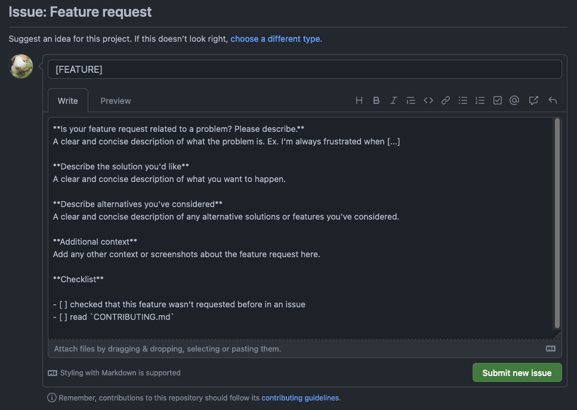

If you are here, that means you've got a great idea for wiki-tui and want to request it. That's awesome!

!!! info
    Before filing a new feature request, please check if there were any previous requests for the same feature. If there are, you can give the issue a :thumbsup: and/or leave a comment with further suggestions

## Creating a new issue

When creating a new issue, please choose the `Feature request` template. It should now look something like this

## Fill it out!

Your next step is to fill in all of the necessary information. Below is everything you need to fill out explained.

#### `Is your feature request related to a problem? Please describe`

Here you can explain whether your feature is related to a problem or inconvenience you've encountered. If it's a nice addition to wiki-tui you can also describe it here.

#### `Describe the solution you'd like`

This is a place to explain what your "solution" or addition ould look like and how the user would use it in the end.

#### `Additional context`

Add images (for example from other applications, aka reference pictures) and further information you'd like to share (like if you want to develop the feature or want to help in development) here

#### `Checklist`

Here you can check the things you have already done

!!! hint "Example"
    A good example of a feature request is the one by [ThomasFrans](https://github.com/ThomasFrans), [here](https://github.com/Builditluc/wiki-tui/issues/49) is the link to it.

## Submit and wait

Once you've filled out the template, you can proudly click on that green `Submit new Issue` button.

<b>
:partying_face: You did it! Thank you very much! :partying_face:
</b>

After you've submitted your feature request we will read it carefully and may ask for further information. If you plan on developing it yourself, please wait until we have approved it.

!!! note
    Sometimes we don't want a specific feature implemented into wiki-tui. If that happens we will give you a detailed explanation of why we think that
