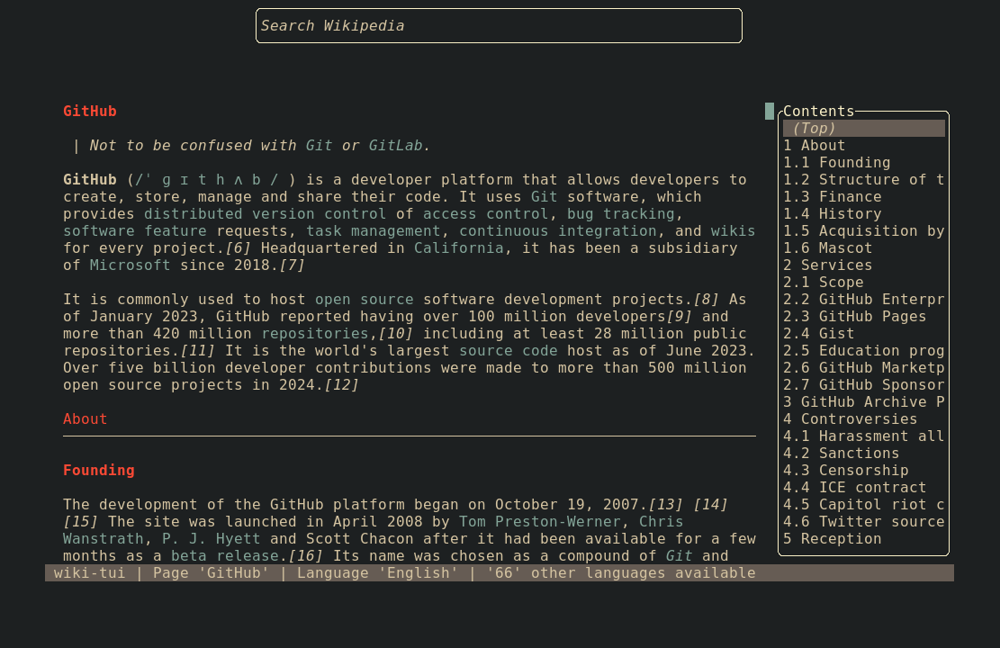
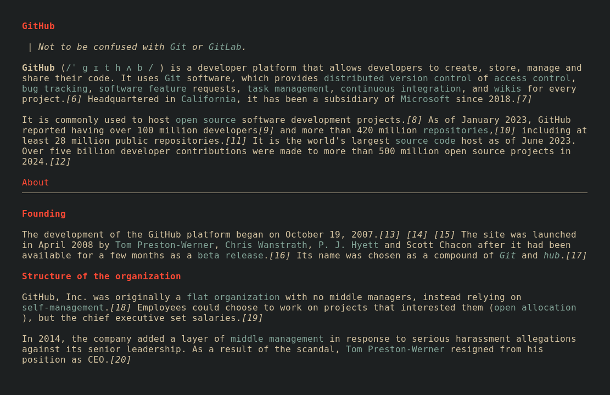

# Page Configuration

In this page you can find all of the configuration options for the page. In the configuration file,
this describes the `[page]` table.

## Padding

[:octicons-tag-24: 0.9.0][release-0.9.0] · :octicons-milestone-16: Default `0`

You can set a padding around the page view (including the table of contents, and the statusbar).
There are different padding options available, each with their own schema of configuring :

* **Uniform**: `page.padding = VAL` Creates a padding with the same values for all sides (left,
    right, top, bottom)
* **Custom**: `page.padding = [VAL, VAL, VAL, VAL]` Creates a padding by specifying every field
    individually. It is `left`, `right`, `top`, `bottom`.
* **Horizontal**: `page.padding.horizontal = VAL` Creates a padding with the same value for left 
    and right
* **Vertical**: `page.padding.vertical = VAL` Creates a padding with the same value for top and
    bottom
* **Proportional**: `page.padding.proportional = VAL` Creates a padding that is visually
    proportional to the terminal. This represents a padding of 2x the value for left and right and 
    1x the value for top and bottom.
* **Symmetric**: `page.padding.symmetric = [VAL, VAL]` Creates a padding that is symmetric. The x 
    value is used for left and right and the y value is used for top and bottom.

> Note: VAL is a u16

## Table of Contents Configuration

### Disabling the Table of Contents

[:octicons-tag-24: 0.5.0][release-0.5.0] · :octicons-milestone-16: Default: `true`

By settings this to false, the table of contents won't be displayed

```toml
page.toc.enabled = false
```

### Changing the Title

[:octicons-tag-24: 0.5.1][release-0.5.1] ·
:octicons-milestone-16: Default: `default`

The available title options for the table of contents are:

* `Default`: uses the title `Contents`
* `Article`: uses the title of the current article
* `Custom`: you can also define a custom title

```toml
page.toc.title = "Default"
```

With a custom title

```toml
page.toc.title = { Custom = "My Custom Title" }
```

### Positioning the Table of Contents

[:octicons-tag-24: 0.5.1][release-0.5.1] ·
:octicons-milestone-16: Default: `Right`
 
Per default, the table of contents is on the right side of the screen. You can also have the table 
of contents be on the left side of the screen

```toml
page.toc.position = "Left"
```

### Adjusting the width

[:octicons-tag-24: 0.9.0][release-0.9.0] · :octicons-milestone-16: Default `20`

You can change the percentage of the space the table of contents will occupy. The values are in
percent (only whole numbers between 0 and 100 are allowed)

```toml
page.toc.width_percentage = 20
```

### Disable Scrolling

[:octicons-tag-24: 0.9.0][release-0.9.0] ·
:octicons-milestone-16: Default: `true`

Will disable scrolling inside of the table of contents if set to `false`

```toml
page.toc.enable_scrolling = true
```

### Modify Item generation

[:octicons-tag-24: 0.5.1][release-0.5.1] ·
:octicons-milestone-16: Default: `{NUMBER} {TEXT}`

If you don't like the look of the items in the table of contents, you can modify how these are generated. Available values are:

* `{NUMBER}`: This is the current number of the header (for example: 1, 1.1, 1.2, 2, ...)
* `{TEXT}`: The text (or content) of the header the item represents

```toml
page.toc.item_format = "{NUMBER} {TEXT}"
```

If you don't like the numbers at the beginning

```toml
page.toc.item_format = "{TEXT}"
```

Or if you want to have a custom beginning

```toml
page.toc.item_format = "# {TEXT}"
```

## Zen Mode

[:octicons-tag-24: 0.9.0][release-0.9.0] · :octicons-milestone-16: Default `""` 

When viewing a page, you can enter `zen-mode` to hide unnecessary and distracting components. To
select which components will be shown even when in `zen-mode`, set the `page.zen_mode.include` 
setting accordingly (The default binding for toggling `zen-mode` is ++f4++). Please note that the 
`zen-mode` setting is individually set for each page, meaning you have to turn it on (again) when 
you're opening a different page.

```toml
page.zen_mode.include = "SCROLLBAR"
```

You can also enable the `zen-mode` by default on a page:

```toml
page.zen_mode.default = false
```

The components currently available to show/hide are:

* `STATUS_BAR`
* `TOC`
* `SEARCH_BAR`
* `SCROLLBAR`

If you want to show multiple components, you can add them together. For example, for showing the 
table of contents and the scrollbar you'd set:

```toml
page.zen_mode.include = "TOC | SCROLLBAR"
```

Alternatively, you can leave out the spaces in between the components:

```toml
page.zen_mode.include  = "TOC|SCROLLBAR"
```

!!! warning
    Do note that these identifiers are case-sensitive, meaning this is not equivalent to the 
    previous (and won't work, because these components don't exist)

    ```toml
    page.zen_mode.include  = "toc | scrollbar"
    ```

    > The exact grammar of the text can be found [here](https://docs.rs/bitflags/2.6.0/bitflags/parser/index.html)

=== "Without Zen-Mode"

    

=== "With Zen-Mode"
    
    


[release-0.9.0]: https://github.com/Builditluc/wiki-tui/releases/tag/v0.9
[release-0.5.1]: https://github.com/Builditluc/wiki-tui/releases/tag/v0.5.1
[release-0.5.0]: https://github.com/Builditluc/wiki-tui/releases/tag/v0.5.0
