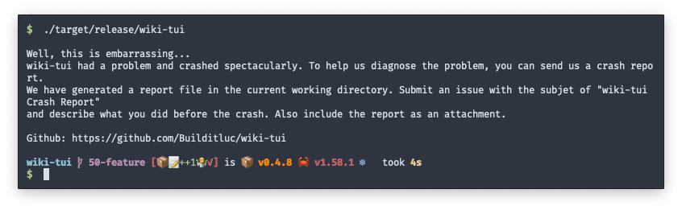

When a crash in wiki-tui occurrs you will see the following output being shown in your terminal.



You will then see a crash report in you current working directory. It contains:

- the version of wiki-tui you are currently using
- your operating system 
- where and why the crash occurrs
- the log file (if available)

The name of the report-file is generated like this

```
crash_report-{UUID}.log
```

Next, please [file a bug report](../contributing/index.md) and upload the crash report so we can work on fixing the problem.
