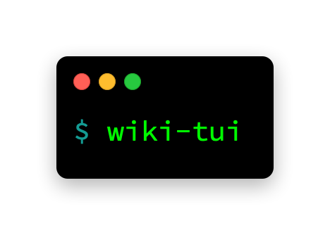
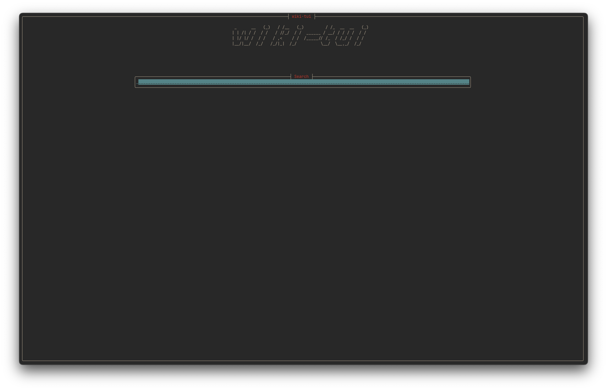
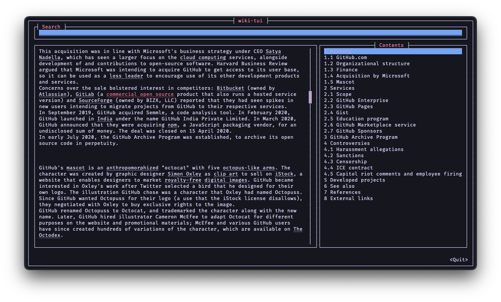

---
hide:
  - title
  - navigation
  - toc
---

#

**WIKI-TUI**

A simple and easy to use Wikipedia Text User Interface

!!! warning "Active Development"
    wiki-tui is still under active-development (v0.x.x) and that means breaking changes, altough relatively rare at the moment, can occur. 

    Please always check the release notes on GitHub before upgrading to a new version!

# How does it look?

# What can I do with it?

## Search

Search for an article in Wikipedia (by default only the English Wikipedia but that can be changed). The search results feature pagination and a little preview is generated when
you select a result.

## Read

When opening an article wiki-tui generates and displays a table of contents on the right side (which can be disabled) where you can quickly jump to any section in the article.
The main article currently supports links and lists with more features like tables and images planned. Although wiki-tui was designed to be used with a keyboard, it also 
supports mouse input (just click on a link or scroll with your scroll wheel in an article).

## Customize

wiki-tui aims to be highly customizable allowing you to change almost everything to your liking. Currently, [customization options](./configuration/overview.md) include:

- [Themes](./configuration/theme.md) (changing colors of the whole program and individual parts)
- [Keybindings](./configuration/keybindings.md) (so you don't have to use the arrow keys for navigation)
- Toggle specific [features](./configuration/features.md) of wiki-tui:
  - Disable the table of contents
  - Disable links
- [Logging](./configuration/logging.md)
- Change the [language](./configuration/api.md) of Wikipedia Articles
